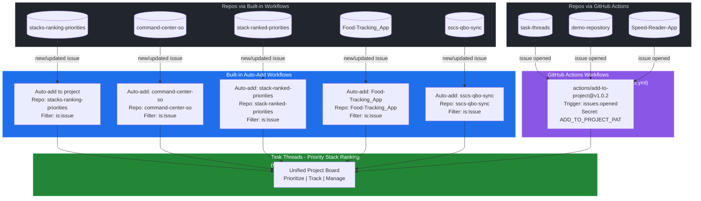

# Task Threads - Priority Stack Ranking: Auto-Add Issue Flows

> **Last Updated:** February 28, 2026
>
> This document maps how issues from all connected repositories automatically flow into the
> [Task Threads - Priority Stack Ranking](https://github.com/orgs/Balancing-Rock/projects/4) project.

## Architecture Overview

## How It Works

### Method 1: Built-in Project Workflows (5 repos)

| Workflow Name | Repository | Filter | Trigger |
|---|---|---|---|
| Auto-add to project | `stacks-ranking-priorities` | `is:issue` | New or updated issue |
| Auto-add: command-center-so | `command-center-so` | `is:issue` | New or updated issue |
| Auto-add: stack-ranked-priorities | `stack-ranked-priorities` | `is:issue` | New or updated issue |
| Auto-add: Food-Tracking_App | `Food-Tracking_App` | `is:issue` | New or updated issue |
| Auto-add: sscs-qbo-sync | `sscs-qbo-sync` | `is:issue` | New or updated issue |

**Limit:** GitHub Team plan supports max 5 auto-add workflows per project.

### Method 2: GitHub Actions (3 repos)

| Repository | Workflow File | Trigger | Auth |
|---|---|---|---|
| `task-threads` | `.github/workflows/auto-add-to-project.yml` | `issues: [opened]` | `ADD_TO_PROJECT_PAT` org secret |
| `demo-repository` | `.github/workflows/auto-add-to-project.yml` | `issues: [opened]` | `ADD_TO_PROJECT_PAT` org secret |
| `Speed-Reader-App` | `.github/workflows/auto-add-to-project.yml` | `issues: [opened]` | `ADD_TO_PROJECT_PAT` org secret |

**Action used:** `actions/add-to-project@v1.0.2`

## Key Principle: Separation of Concerns

- **Issues live in their repos.** Each issue retains its repo-level context: labels, milestones, branches, PRs, and CI/CD.
- **The project is an organizational layer.** It provides a unified cross-repo view for centralized prioritization and tracking.
- **Work happens in the repo.** Branching, code review, and merging all stay scoped to the originating repository.

## Authentication

- **Org Secret:** `ADD_TO_PROJECT_PAT` (classic PAT with `repo` + `project` scopes)
- **Visibility:** All private repositories in the Balancing-Rock org
- **Expiration:** No expiration (monitor and rotate as needed)
